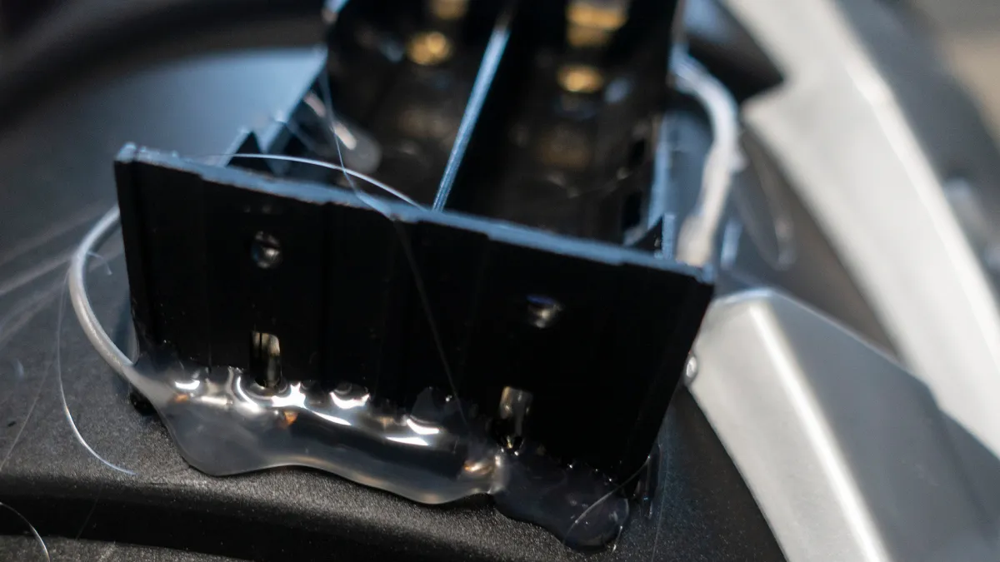

# Fog Cannon
Making a fog cannon 2019-05-12

My daughter wanted to make some big dice after practices started in the play Guys and Dolls. So we cut some squares from a 2×2 and she sanded, carved and painted them until she had a couple sets of dice. The director liked them so much, she ended up using them in the play, which made my daughter super happy. Mulan was the next play and she and her mom were busy with ideas about what they could make this time. They decided it would be neat if they could make the Chinese rocket that Mulan used to create the avalanche. They figured that the proper work breakdown would be that I would build a small fog canon that could shoot a smoke ring and they would decorate it.

So I headed over to YouTube to find a DIY air canon that could shoot some fog. I found [this one](https://www.youtube.com/watch?v=BuH-hWrjZmw). As I set out to make one out of a Home Depot bucket I also found a couple instructions around how to make a small fog machine. [This one](https://www.instructables.com/id/Battery-Powered-Fog-Machine/) and [this one](http://henchwenchcosplay.com/index.php/2016/11/16/how-to-make-a-compact-smoke-machine-for-cosplay-for-under-30/) and this [similar one](http://valkyriestudios.net/making-a-mini-fog-machine/). It didn’t look like enough fog, but I started buying the stuff to make one, or three, just in case. At the same time I got a regular fog machine, you know, for testing. I also looked for a small fog machine that I could just buy, but those were all super expensive ($800-$1,600). I did eventually find this small and [super cool fog machine](https://www.ebay.com/itm/MicroFogger-the-portable-battery-powered-mini-smoke-fog-machine-generator-/173813298322). Once you know what it is called, “MicroFogger”, then it is easy to find, but it took me a few sessions of searching. I also bought an “AirZooka”, which is a pre-made air canon.

So first the failures. The Home Depot bucket DIY air canon works, but is too heavy and hard to handle for someone the size of my daughter. We still had fun with it, but it’s just too big. I made a smaller one out of a concrete mold, but that was not tapered and the smoke ring went too slow. I mostly tested these with the regular fog machine by just sucking up some fog while pulling back.

Also not working is trying to use a fan, small or large, to suck or push air through a vape pen.

So after much failed experimentation, I chose to use a vape pen with a small aquarium pump, much like in the DIY articles. One of the advantages is that they both take the same voltage and can be driven with an 18650 battery. With patience and extreme care, the batteries can be salvaged from an old laptop battery pack. The battery is paired with a holder that can be used serial or parallel. We will use it in parallel so there will be plenty of run time.

I actually liked using a larger aquarium pump, but it was going to end up more difficult to mount. There will be two of these inside of the air canon to make sure we can get enough fog in a short amount of time. The first one was assembled with a little solder, a piece of tubing with a cut slot and a lot of hot glue. The second was assembled with less hot glue and a threaded, 3D printed part. Both were tapped up to be air tight and hold together.

I also chose to just use the AirZooka instead of a DIY effort as it was sized pretty good and I could get a moment switch into the handle without too much trouble. A moment switch is good, because you can leave it on accidentally.

Then mount the battery holder with a couple screws and hot glue things down.

Next we need a way to mount the vape pen assemblies inside the air canon. To do this I 3D printed a front mount that the tip could go into and a rear mount that the pump could snap into. The front mount had to be reprinted with some more base to be at the right height and the rear mount took a few tries to get just the right sizing to hold without breaking.

Small bolts hold everything mounted inside the air canon and the vape pens are filled with fog juice. The wiring is taped down to the inside to stay out of the way. The final covering is decorated canvas with Velcro to hold it on, but still able to come off to replace the batteries.

